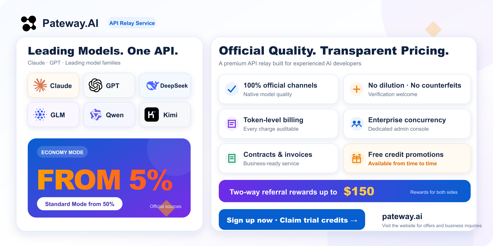
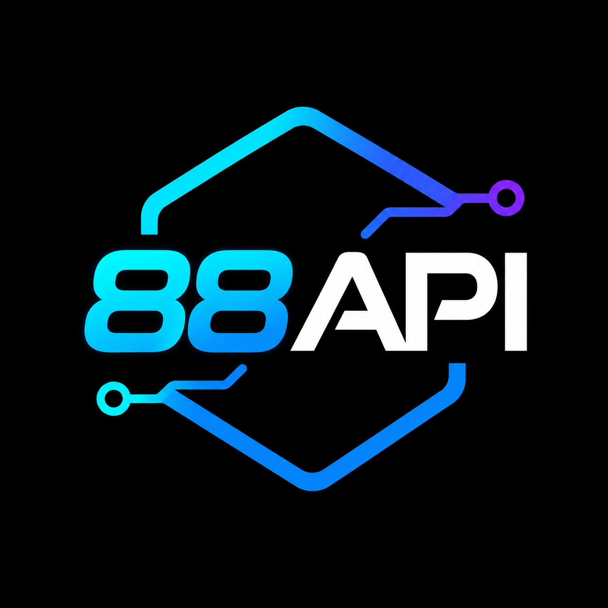
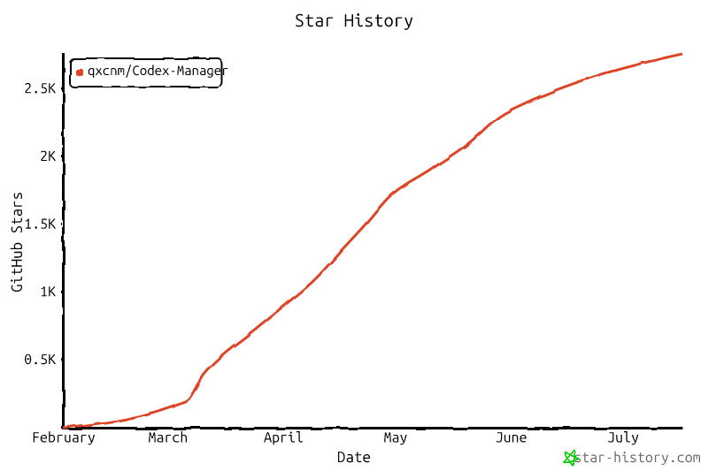

<table align="center">
  <tr>
    <td align="center" valign="middle" width="44%">
      
      <br />
      <sub>
        <a href="https://qxnm.top/">공식 사이트</a> ·
        <a href="#스폰서">스폰서</a>
      </sub>
    </td>
    <td align="center" valign="middle" width="13%">
      <sub>
        <a href="../../README.md">中文</a>
        <br />
        <a href="../en/README.md">English</a>
        <br />
        <a href="../ru/README.md">Русский</a>
        <br />
        <strong>한국어</strong>
      </sub>
    </td>
    <td align="center" valign="middle" width="23%">
      <a href="https://github.com/qxcnm/Codex-Manager">
        
      </a>
      <br />
      <a href="https://atomgit.com/qxnm/Codex-Manager">
        
      </a>
      <br />
      <a href="https://gitee.com/hongshungao/Codex-Manager">
        
      </a>
    </td>
    <td align="center" valign="middle" width="20%">
      <sub><strong>인정 커뮤니티</strong></sub>&nbsp;
      <a href="https://linux.do/t/topic/1688401" title="LINUX DO">
        
      </a>
      &nbsp;
      <a href="https://xuanwu.openatom.org/articles/project/codex-manager/" title="쉬안우 커뮤니티">
        
      </a>
    </td>
  </tr>
</table>

**CodexManager는 [쉬안우 커뮤니티](https://xuanwu.openatom.org/articles/project/codex-manager/)에 합류했습니다.** 이 커뮤니티는 OpenAtom Foundation이 인큐베이팅하고 운영하는 Rust 기술 커뮤니티입니다.

<table>
  <tr>
    <td valign="top" width="50%">
      <strong>소스 코드 안내</strong>
      <br />
      <sub>
        이 제품은 제가 지휘하고 AI의 도움을 받아 제작했습니다: Codex(98%), Gemini(2%). 문제가 발생하면 서로 존중하며 소통해 주세요. 모든 패키지를 검증할 수 있는 환경을 갖추지 못했기 때문에 Windows 데스크톱 버전만 사용 가능성을 보장합니다. 다른 플랫폼의 문제는 충분히 테스트한 뒤 Issue로 제출해 주세요. 플랫폼별 문제를 제보하고 테스트에 참여해 주신 모든 분께 감사드립니다.
      </sub>
    </td>
    <td valign="top" width="50%">
      <strong>면책 조항</strong>
      <br />
      <sub>
        이 프로젝트는 학습과 개발 목적으로만 제공됩니다. 사용자는 OpenAI, Anthropic 등 관련 플랫폼의 서비스 약관을 준수해야 합니다. 작성자는 계정, API Key 또는 프록시 서비스를 제공하거나 배포하지 않으며 소프트웨어의 구체적인 사용 방식에 책임을 지지 않습니다. 속도 제한이나 서비스 제한을 우회하는 용도로 사용하지 마세요.
      </sub>
    </td>
  </tr>
</table>

## 스폰서

이 프로젝트는 스폰서 협업을 받고 있으며 비용은 협의할 수 있습니다. 스폰서는 README와 프로젝트 내 스폰서 영역에 브랜드 로고, 소개, 공식 링크를 표시할 수 있습니다. 문구, 위치, 표시 기간, 게시 시점은 상호 협의하며, 개발자 또는 AI 도구 생태계와 관련되고 관련 법규를 준수해야 합니다.

**협업 문의:** WeChat, Telegram 또는 `18272669457@163.com`으로 연락해 주세요. WeChat 친구 추가 시 “스폰서 협업”이라고 적어 주세요.

CodexManager를 지원해 주신 모든 분과 파트너께 감사드립니다.

[](https://pateway.ai/?ch=kimnmd)

이 프로젝트를 후원해 주신 <strong>PatewayAI</strong>에 감사드립니다!

PatewayAI는 공식 고품질 모델 API 중계에 집중하며 Claude와 Codex 시리즈를 완전히 지원하고, 투명한 과금과 엔터프라이즈급 서비스를 제공합니다.

경제 모드는 표준 요금의 5%부터 시작합니다. <a href="https://pateway.ai/?ch=kimnmd" rel="sponsored nofollow">이 링크</a>로 가입하면 체험 크레딧과 비정기 무료 크레딧 이벤트에 참여할 수 있으며, 양방향 추천 보상은 최대 150달러입니다.

---

<table>
  <tr>
    <td align="center" valign="middle" width="180">
      <a href="https://vmcardio.com/zh/register?code=OPK6X2DSLW"></a>
    </td>
    <td valign="top">
      <strong><a href="https://vmcardio.com/zh/register?code=OPK6X2DSLW">VMCard 엔터프라이즈 가상 카드 발급 플랫폼</a></strong>은 AI 계정 플랫폼, AI API 제공업체 및 대규모 구독 팀을 위해 미국 Visa 전용 BIN, API 일괄 카드 발급, 엔터프라이즈 카드 관리를 제공합니다.<br />
      장기·대규모 기업 결제에 적합한 경쟁력 있는 정산 환율을 제공합니다. 비즈니스 문의: <a href="https://t.me/Vmcardio_yuki">@Vmcardio_yuki</a>
    </td>
  </tr>
  <tr>
    <td align="center" valign="middle" width="180">
      <a href="https://88api.ai/sign-up?aff=OceE"></a>
    </td>
    <td valign="top">
      <strong><a href="https://88api.ai/sign-up?aff=OceE">88API 올인원 모델 통합 플랫폼</a></strong><br />
      🧠 GPT, Claude, Gemini, Grok, DeepSeek, Kimi, GLM 등 언어·코딩 모델;<br />
      🎨 GPT-Image, Gemini, Grok 등 이미지 모델;<br />
      🎬 Seedance, Veo, MiniMax Hailuo H3, Kling, Grok 등 비디오 모델;<br />
      🎙️ Whisper, TTS 등 음성 기능으로 문구 작성부터 이미지·비디오 생성과 더빙까지 지원합니다.<br />
      🎁 신규 사용자는 모델 테스트용 체험 크레딧을 받고 사이트의 상담 지원을 이용할 수 있습니다.<br />
      👉 해외 법인 자격으로 운영하며 정식 청구서와 1:1 충전 비율을 제공합니다.
    </td>
  </tr>
  <tr>
    <td align="center" valign="middle" width="180">
      <a href="https://api.fenno.ai/s/4ADZ"></a>
    </td>
    <td valign="top">
      <strong><a href="https://api.fenno.ai/s/4ADZ">FennoAI</a></strong>는 기업 R&amp;D 팀과 개발자를 위한 안정적이고 고성능인 API 중계 서비스를 제공합니다. OpenAI와 Anthropic 프로토콜을 지원하며 Codex, Claude Code, OpenCode 등과 연동됩니다. 엔터프라이즈 인프라는 하루 수천억 Token 규모와 기업 정산·청구를 지원합니다. Codex-Manager 사용자는 <a href="https://api.fenno.ai/s/4ADZ">전용 링크</a>로 50달러 상당의 Coding Plan을 1.99달러에 이용할 수 있으며 추천 수익은 최대 20%입니다.
    </td>
  </tr>
  <tr>
    <td align="center" valign="middle" width="180">
      <a href="https://s.qiniu.com/eiaQrq"></a>
    </td>
    <td valign="top">
      <strong><a href="https://s.qiniu.com/eiaQrq">Qiniu Cloud AI</a></strong>는 Qiniu Cloud(02567.HK)의 엔터프라이즈 대규모 모델 MaaS 플랫폼으로, 텍스트·이미지·오디오·비디오·파일 처리를 포함한 150개 이상의 글로벌 모델을 한 곳에서 제공합니다. <a href="https://s.qiniu.com/eiaQrq">전용 링크</a>로 가입하면 Codex-Manager 기업 사용자는 1,200만 Token, 개발자는 300만 Token을 무료로 받을 수 있습니다.
    </td>
  </tr>
  <tr>
    <td align="center" valign="middle" width="180">
      <a href="https://www.aixiamo.com/?utm_source=github&utm_medium=sponsor&utm_campaign=codex_manager&utm_content=logo_brand_home_v3"></a>
    </td>
    <td valign="top">
      <strong><a href="https://www.aixiamo.com/?utm_source=github&utm_medium=sponsor&utm_campaign=codex_manager&utm_content=brand_home_v3">AIXiamo 공식 사이트 | 중국 내 본인 계정 ChatGPT Plus / Pro 정식 충전</a></strong><br />
      <strong>Codex 한도가 부족하다면 Plus와 Pro 중 무엇을 선택할까요?</strong> 일상 사용은 <a href="https://www.aixiamo.com/chatgpt-plus-domestic-recharge?utm_source=github&utm_medium=sponsor&utm_campaign=codex_manager&utm_content=plus_owner_v3">Plus</a>, 한도에 자주 도달하거나 장시간 작업은 <a href="https://www.aixiamo.com/chatgpt-pro?utm_source=github&utm_medium=sponsor&utm_campaign=codex_manager&utm_content=pro_owner_v3">Pro 5x / 20x</a>를 비교하세요.<br />
      <strong>스폰서 가이드:</strong> <a rel="sponsored nofollow" href="https://github.com/momochoog/gpt-daichong">2026 중국 ChatGPT Plus / Pro 충전 및 요금제 선택 가이드</a><br />
      해외 은행 카드 없이 Alipay를 지원하며 비밀번호, 인증 코드, 복구 코드를 요구하지 않습니다. 주문 조회와 중국어 상담을 제공하고, 충전 실패 시 확인 후 전액 환불합니다. Claude Pro / Max, Gemini, Grok / SuperGrok 등도 제공합니다.<br />
      기업 구매도 가능하며, <a href="https://www.aixiamo.com/articles/aixiamo-invoice-application-notice-2026?utm_source=github&utm_medium=sponsor&utm_campaign=codex_manager&utm_content=invoice_notice_v3">완료된 주문은 상담 확인 후 청구서를 신청</a>할 수 있습니다.
    </td>
  </tr>
  <tr>
    <td align="center" valign="middle" width="180">
      <a href="https://gzxsy.vip/register?aff=eapz"></a>
    </td>
    <td valign="top">
      <strong>Xing Si Yan Gateway</strong>는 Claude Code, Codex 등 모델 호출을 위한 안정적인 중계와 지원 서비스를 제공합니다. 고가용성 API, 간편한 도입, 지속적인 제공 지원이 필요한 개발자와 팀에 적합합니다. 최신 상품은 <a href="https://gzxsy.vip/register?aff=eapz">공식 사이트</a>에서 확인하세요.
    </td>
  </tr>
</table>

그 밖의 후원자: 呆头呆脑, [Wonderdch](https://github.com/Wonderdch), [suxinwl](https://github.com/suxinwl), [Hermit](https://github.com/HermitChen), [Suifeng023](https://github.com/Suifeng023), [HK-hub](https://github.com/HK-hub)

## ☕ 프로젝트 후원

이 프로젝트가 도움이 되었다면 후원해 주세요!

<table>
  <tr>
    <th>Alipay</th>
    <th>WeChat Pay</th>
  </tr>
  <tr>
    <td align="center"></td>
    <td align="center"></td>
  </tr>
</table>

## Star History

<a href="https://www.star-history.com/?repos=qxcnm%2FCodex-Manager&type=date&legend=top-left">
 <picture>
   <source media="(prefers-color-scheme: dark)" srcset="../../assets/images/star-history-dark.png" />
   <source media="(prefers-color-scheme: light)" srcset="../../assets/images/star-history-light.png" />
   
 </picture>
</a>

## 홈 탐색

| 하려는 작업 | 바로가기 |
| --- | --- |
| 최초 실행, 배포, Docker, macOS 허용 설정 | [실행 및 배포 가이드](report/실행-및-배포-가이드.md) |
| Codex CLI / ccswitch, `auth.json`, `config.toml` 설정 | [실행 및 배포 가이드](report/실행-및-배포-가이드.md#ccswitch를-통한-연결) |
| Codex 로그인 없이 ChatGPT `/api/auth/session`으로 계정 가져오기 | [중국어 ChatGPT session 가져오기 가이드](../zh-CN/report/不登陆Codex使用ChatGPT-auth-session导入账号.md) |
| 포트, 프록시, 데이터베이스, Web 암호, 환경변수 설정 | [환경변수 및 실행 설정](report/환경변수-및-실행-설정-안내.md) |
| 계정 라우팅, 가져오기 실패, challenge, 요청 오류 해결 | [FAQ 및 계정 라우팅 규칙](report/FAQ-및-계정-라우팅-규칙.md) |
| 백그라운드 작업이 계정을 건너뛰거나 비활성화하는 이유 | [백그라운드 작업 계정 안내](report/백그라운드-작업-계정-건너뛰기-안내.md) |
| 모델, 가격, 라우트, instructions policy, 로컬 cache 내보내기 | [중국어 Model Catalog V2 가이드](../zh-CN/report/模型目录V2管理与计费说明.md) |
| 플러그인 센터 최소 연동 | [플러그인 센터 최소 연동 안내](report/플러그인-센터-최소-연동-안내.md) |
| 플러그인 인터페이스, marketplace 모드, Rhai API | [플러그인 센터 연동 및 인터페이스](report/플러그인-센터-연동-및-인터페이스-목록.md) |
| 전체 시스템 내부 인터페이스 | [시스템 내부 인터페이스 총람](report/시스템-내부-인터페이스-총람.md) |
| 로컬 빌드, 패키징, 릴리스, 스크립트 | [빌드·릴리스·스크립트 가이드](release/빌드-릴리스-및-스크립트-가이드.md) |

## 기능 개요

- 계정 풀 관리: 그룹, 태그, 정렬, 메모, 차단 감지와 필터링.
- 일괄 가져오기/내보내기: 여러 파일, 데스크톱 JSON 폴더 재귀 가져오기, 계정별 단일 파일 내보내기.
- 사용량 표시: 표준 5시간 + 7일 창, 7일 전용 계정, Code Review / Spark 등의 추가 한도를 남은 비율과 초기화 시간으로 통합 표시.
- 계정 인증: `chatgpt.com` 브라우저 OAuth와 Device Code 로그인, 콜백 URL 수동 붙여넣기.
- 플랫폼 Key: 임의 또는 고정 Key, 비활성화, 삭제, 모델·추론·서비스 등급 바인딩, 사용자 그룹과 플랜 필터의 교집합 내 순환.
- 모델 관리: Model Catalog V2를 유일한 런타임 기준으로 사용하며 builtin/custom, 3단계 및 긴 컨텍스트 가격, 계정 풀/집계 API 라우트, instructions policy, JSON preview/commit, Codex cache 내보내기를 지원.
- 집계 API: V2 라우트 기준으로 외부 upstream 생성, 편집, 잔액, 연결 테스트를 제공하며 모델은 관리자가 가져와 선택적으로 연결.
- 플러그인 센터: `/plugins/`에서 내장 추천, 기업 비공개, 사용자 소스 marketplace와 manifest, 작업, 로그, Rhai 인터페이스를 제공.
- Skills와 플러그인: `/skills/`에서 Skills 설치와 Codex Plugin 설치를 분리하고 GitHub, skills.sh, ZIP/폴더 가져오기와 설치 관리를 지원하며 `.system` Skills는 읽기 전용.
- 프로젝트 실행: 데스크톱에서 로컬 폴더를 즐겨찾기하고 Windows/macOS의 ChatGPT Codex App으로 열며, “세션”은 로컬 프로필로 새 터미널의 `resume` 선택기를 실행.
- 설정: 시스템 추론, 계정별 동시성, upstream proxy, 전체/stream idle timeout, SSE keepalive와 고동시성 저하 정책. `CODEXMANAGER_SSE_KEEPALIVE_ENABLED=0`으로 keepalive를 끄고 `CODEXMANAGER_USE_WEBSOCKET_UPSTREAM=1`로 실험적 WebSocket을 켤 수 있음.
- 시스템 내부 인터페이스 목록: 데스크톱/서비스 명령, RPC 메서드, 플러그인 내장 함수.
- 로컬 서비스: 자동 시작, 포트와 수신 주소 설정.
- 로컬 게이트웨이: Codex CLI, Gemini CLI, Claude Code와 타사 도구를 위한 OpenAI 호환 엔드포인트; Gemini → `/v1/responses`, SSE, tools, MCP, skills, 요청/스트림 timeout 지원.
- 이미지 생성: `/v1/responses`에 `image_generation` tool을 기본 주입하고 `/v1/images/generations`, `/v1/images/edits` 제공, 기본 모델은 `gpt-image-2`.

## 스크린샷


## 빠른 시작

1. 데스크톱 앱을 실행하고 **서비스 시작**을 클릭합니다.
2. **계정 관리**에서 브라우저 인증 또는 Device Code를 선택해 `chatgpt.com`에 로그인합니다.
3. 브라우저 콜백이 실패하면 콜백 URL을 붙여넣어 수동으로 처리합니다.
4. 사용량을 새로고침하고 계정 상태를 확인합니다.

## 기본 데이터 디렉터리

- 데스크톱 앱의 SQLite 데이터베이스는 앱 데이터 디렉터리에 `codexmanager.db`로 저장됩니다.
- Windows: `%APPDATA%\\com.codexmanager.desktop\\codexmanager.db`
- macOS: `~/Library/Application Support/com.codexmanager.desktop/codexmanager.db`
- Linux: `~/.local/share/com.codexmanager.desktop/codexmanager.db`
- 업그레이드 후 첫 초기화 전에 같은 디렉터리에 `codexmanager.db.pre-<버전>.bak`을 남기며 같은 버전의 재시도는 덮어쓰지 않습니다.
- 설정의 “데스크톱 진단”에서 Debug 모드, 일반 파일 로그 비활성화, 로그 폴더 열기를 사용할 수 있습니다. 일반 로그는 512KB로 제한되며 요청 로그와 Token/비용 통계는 영향을 받지 않습니다.
- UI가 시작되지 않으면 `CodexManager.exe --debug`(macOS/Linux는 `CodexManager --debug`)를 사용하세요. 오류 이유를 표시하고 안내된 디렉터리에 `startup-error.log`를 기록합니다.
- 데이터베이스, 프록시, 수신 주소 등은 [환경변수 및 실행 설정](report/환경변수-및-실행-설정-안내.md)을 참고하세요.
- Docker 기본값은 `TZ=Asia/Shanghai`이며 Compose는 환경의 `TZ`를 우선 사용합니다. 다른 지역에서는 적절한 IANA 시간대를 설정하세요.

## 화면 안내

### 데스크톱

- 계정 관리: 계정과 사용량 가져오기, 내보내기, 새로고침, 낮은 한도/차단 필터와 초기화 시간.
- 플랫폼 Key: 모델, 추론 등급, 서비스 등급별 Key 바인딩과 호출 로그.
- 모델 관리: 데스크톱/Web은 `~/.codex/models_cache.json`을 기록하거나 다운로드하지 않습니다. 직접 계정은 공식 카탈로그, 로컬 게이트웨이는 독립 관리 카탈로그를 사용합니다.
- 플러그인 센터: `/plugins/` marketplace 전환, 설치·활성화, 작업, 로그, Rhai.
- Skills와 플러그인: `/skills/` 별도 탭, GitHub/skills.sh 설치, ZIP/폴더 가져오기, 안전한 제거, Marketplace, 읽기 전용 시스템 Skills.
- 프로젝트 실행: 데스크톱은 로컬 폴더를 저장하고 Windows/macOS는 ChatGPT Codex App으로 엽니다. 세션은 로컬 CLI를 사용하며 Web/Docker는 장치 폴더에 접근하지 않습니다.
- 설정: 포트, 수신 주소, 프록시, timeout, SSE keepalive, 테마, 업데이트, 백그라운드 동작.

### Service 버전

- `codexmanager-service`: 로컬 OpenAI 호환 게이트웨이.
- `codexmanager-web`: 브라우저 관리 화면과 `/api/runtime`, `/api/rpc` 프록시.
- `codexmanager-start`: service + web 동시 시작.

## 주요 문서

- 변경 이력: [변경 이력](변경-이력.md)
- 기여 가이드: [기여 가이드](기여-가이드.md)
- 아키텍처: [아키텍처](아키텍처.md)
- 테스트: [테스트](테스트.md)
- 보안: [보안](보안.md)
- Model Catalog V2: [중국어 가이드](../zh-CN/report/模型目录V2管理与计费说明.md)
- 문서 인덱스: [중국어 문서 인덱스](../zh-CN/README.md)

## 주제별 문서

| 문서 | 내용 |
| --- | --- |
| [실행 및 배포 가이드](report/실행-및-배포-가이드.md) | 최초 실행, Docker, Service 버전, macOS 허용 |
| [환경변수 및 실행 설정](report/환경변수-및-실행-설정-안내.md) | 앱 설정, 프록시, 주소, 데이터베이스, Web 보안 |
| [FAQ 및 계정 라우팅 규칙](report/FAQ-및-계정-라우팅-규칙.md) | 계정 선택, challenge, 가져오기/내보내기, 오류 |
| [중국어 ChatGPT session 가이드](../zh-CN/report/不登陆Codex使用ChatGPT-auth-session导入账号.md) | session JSON 복사와 일괄 가져오기 |
| [백그라운드 계정 안내](report/백그라운드-작업-계정-건너뛰기-안내.md) | 백그라운드 필터, 비활성 계정과 workspace 상태 |
| [최소 문제 해결 가이드](report/최소-문제해결-가이드.md) | 서비스 시작, 요청 중계, 모델 새로고침 |
| [플러그인 센터 연동](report/플러그인-센터-연동-및-인터페이스-목록.md) | 라우트, marketplace, Tauri/RPC, manifest, Rhai |
| [빌드·릴리스·스크립트](release/빌드-릴리스-및-스크립트-가이드.md) | 로컬 빌드, Tauri, workflow, 스크립트 |
| [릴리스 및 산출물](release/릴리스-및-산출물-안내.md) | 플랫폼별 산출물, 이름, pre-release |
| [스크립트·릴리스 책임](report/스크립트-및-릴리스-책임-매트릭스.md) | 스크립트 역할과 사용 시점 |
| [게이트웨이와 Codex 차이](report/게이트웨이와-Codex-헤더-및-파라미터-차이.md) | 요청 헤더와 파라미터 비교 |
| [시스템 내부 인터페이스](report/시스템-내부-인터페이스-총람.md) | 데스크톱, 서비스, 플러그인 센터 인터페이스 |
| [변경 이력](변경-이력.md) | 릴리스, 미출시 변경, 전체 이력 |

## 디렉터리 구조

```text
.
├─ apps/                # 프런트엔드와 Tauri 데스크톱
│  ├─ src/
│  ├─ src-tauri/
│  └─ out/
├─ crates/              # Rust core/service
│  ├─ core
│  ├─ service
│  ├─ start              # service + web 시작
│  └─ web                # Service Web UI와 /api/rpc 프록시
├─ docs/                # 공식 문서
├─ scripts/             # 빌드·릴리스 스크립트
└─ README.md
```

## 감사 및 참고 프로젝트

- Codex(OpenAI): 요청 흐름, 로그인 의미, upstream 호환 구현과 소스 구조를 참고했습니다. <https://github.com/openai/codex>
- CLIProxyAPI(CPA): Responses 요청 변환과 tool call 규칙을 참고했습니다. <https://github.com/router-for-me/CLIProxyAPI>

## 연락처

- WeChat 공식 계정: 七线牛马
- WeChat: 그룹 참여는 `ProsperGao`를 추가하고 목적을 알려 주세요.
- Telegram: [CodexManager TG 그룹](https://t.me/+OdpFa9GvjxhjMDhl)
